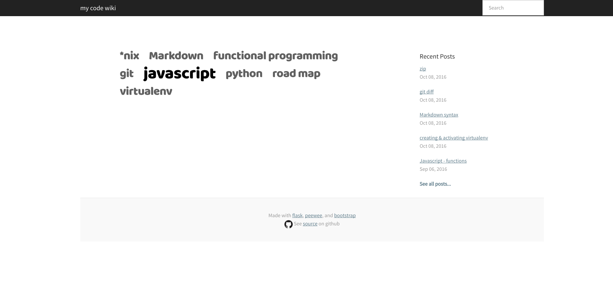

Overview
---------
This is a code box I made for myself, with a tag word cloud to visualize which topics I'm working on the most over time.  
Example live here: http://ashoofly.pythonanywhere.com/

Screenshots
------------

References
-------------
starter project taken from: http://charlesleifer.com/blog/how-to-make-a-flask-blog-in-one-hour-or-less/  
starter code at: https://github.com/coleifer/peewee/tree/master/examples/blog

